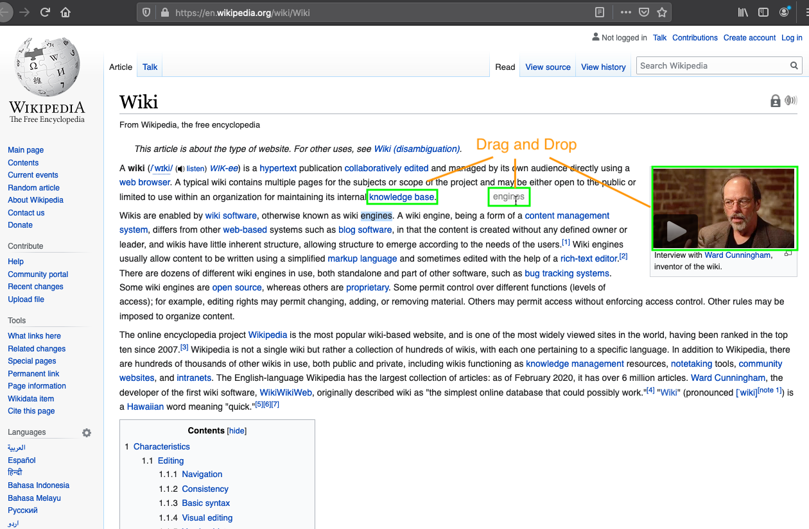
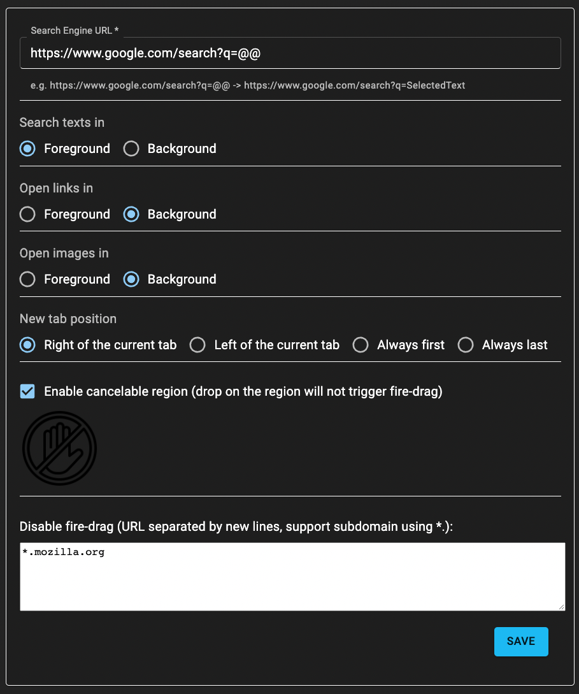

Since many drag&drop add-on are outdated or does not support
e10s(multi-process: <a href="https://wiki.mozilla.org/Electrolysis">https://wiki.mozilla.org/Electrolysis</a>)

This simple add-on allows users to drag:
<ul>
<li>texts: search in foreground/background tabs</li>
<li>links: open in foreground/background tabs</li>
<li>images: open in foreground/background tabs</li>
<li>customize the search engine</li>
<li>disable fire-drag on some websites</li>
</ul>

PS: NO RESTART but need to refresh the web pages.

*source code*: <a href="https://github.com/erictsangx/fire-drag">https://github.com/erictsangx/fire-drag</a>

*link*: <a href="https://addons.mozilla.org/en-US/firefox/addon/fire-drag">https://addons.mozilla.org/en-US/firefox/addon/fire-drag</a>
